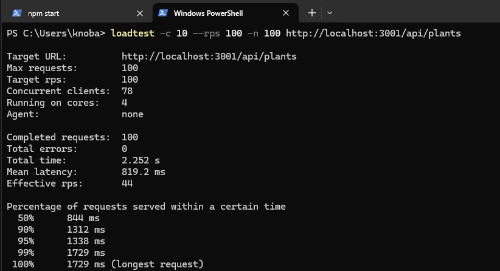
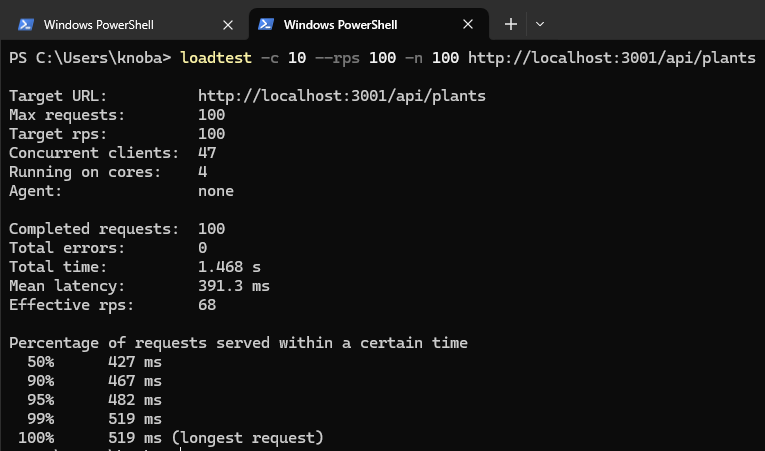
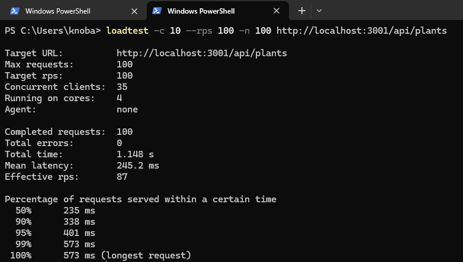
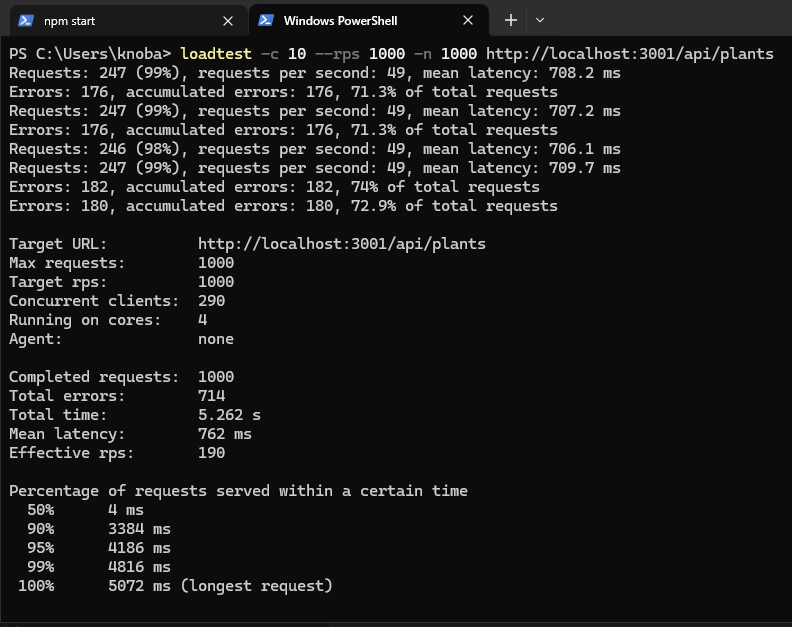
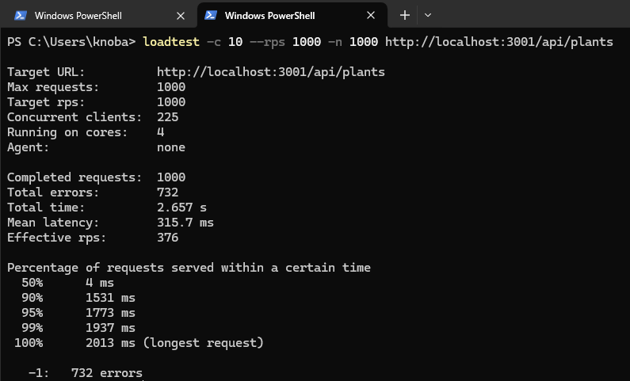
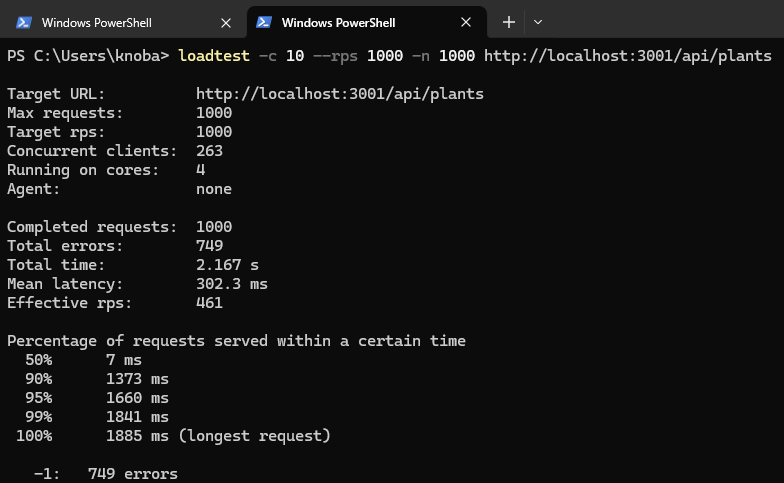

# Seeds

API for seeds and plants management.

# Setup

## Requirements

- Docker for mongodb and node for server.
- Pm2 and loadtest installed globally.

## CMDs

1. `cp .env.example .env`
2. `docker compose up -d`
3. `npm i`
4. `pm2 start index.js -i n` replace n for a integer of core number

# Tests

Before run tests commands insert plants seed to populate database, use this curl:

```
curl --request POST \
  --url http://localhost:3001/api/plants/seed \
  --header 'User-Agent: Insomnia/2023.5.5'
```

## `loadtest -c 10 --rps 100 -n 100 http://localhost:3001/api/plants`

### 1 core



### 3 core



### 5 core



## `loadtest -c 10 --rps 1000 -n 1000 http://localhost:3001/api/plants`

### 1 core



### 3 core



### 5 core


